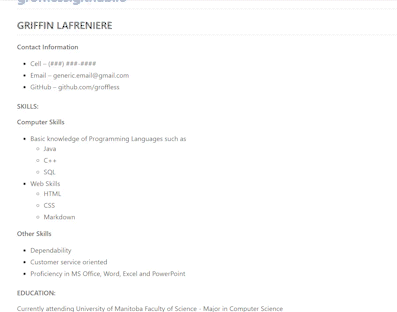
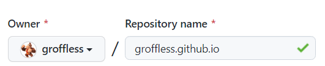
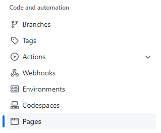
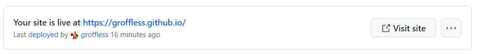

# Hosting A Resume Using GitHub Pages and Markdown

### Introduction
--------------

Hello and welcome to my [GitHub Pages](https://pages.github.com/) tutorial where we will create our own static website in GitHub Pages using Markdown. First of all, what is Markdown? Markdown is a lightweight markup language which is very easy to read. It is like a less confusing version of writing HTML and is used for many different things, most notably as an overview for projects. Inside a project, you will likely find a README.md file that includes the documentation about the project, how to run it as well if there are any bugs involved. 

If you want to learn more about documentation you should check out Andrew Etter's book where he talks about techniques you can use in your writing. He talks about the importance of using lightweight markup languages and why you should use a static website. He also explains why distributing PDFs is not worth it as you are not updating PDFs like you are when writing with a markup language.

### Prerequisites
-------------
To start writing markdown you are going to need an editor. There are plenty of markdown editors you can easily find online for free such as [Typora](https://typora.io/). I use [Visual Studio Code](https://code.visualstudio.com/), which is not necessarily the best for writing Markdown, but enough for what I need with its built-in features and extensions.

Before continuing you need to have some sort of basic knowledge of markdown. I suggest looking at one of the two markdown tutorials that can be found under [More Resources](#more-resources) towards the bottom of the page. 

When writing a markdown you want to think about your reader. You want your content to be discoverable and easy to find. If no one is reading your documentation, then who is it for? You are writing for your reader and no one else.

### Instructions
-------------

#### Hosting a Resume

The goal we want to accomplish is to host your resume in a static site generator. Static sites are great in the fact that they are much easier to manage compared to your own website. Using static websites allows you to easily share your documentation with others. Make a new resume in markdown.

If you already have a resume, convert it to markdown. Once you have your markdown file ready we can upload it to GitHub Pages which is a static site generator.

Our end goal is to host your resume like this.

Let's begin the process to host a Resume using GitHub Pages!

__Step 1: Create New Repository__

If you have not already logged in to GitHub, do so now. Alternatively, you can do this with both [GitHub Desktop](https://desktop.github.com/) and the browser. For this example, I will be using GitHub on the Browser. We will start by creating a new repository

1. Go to the home page on GitHub.
2. Click the green button labelled "New". 
        

In order to host your site on GitHub Pages you will need to be ___very specific___ with your repository name. 

3. Under the repository name
    - Write your GitHub username, followed by .github.io.

    - It should look something like this 

4. Make sure to check off initialize the repository with a README.

5. Create the repository.

__Step 2: Adding your files__

After creating your repository you will be inside your newly created repository. Now we are going to add your resume file.

1. Under on __Add Files__ click on __Upload Files__.
2. Locate your README.md file and add it to the repository.
    - additionally, you could add other files (if needed). 
3. Commit your changes.

__Step 3: Finding your Page__

Moving back to our repository we want to head into its settings.

1. Click on the __Settings__ option found in your repository. Alternatively, if you are in a smaller window it can be found in a drop down menu.

2. Click on __Pages__ found under Code and Automation.

3. Click on __Visit site__ (Optional: save the link).

Congratulations! You now have your own resume hosted on GitHub Pages. Feel free to share your link with others or employers you want to send your resume to. Keep in mind you can only host one GitHub Pages at a time. If you have trouble finding check out "[Why is my resume not showing up?](#frequently-asked-questions)" in the Frequently Asked Questions.

### Adding Layouts
------------

You might think to yourself that you dislike the layout of your markdown. It might have something to do with the default font of markdown or you even wish you could change the size of your font. For those that want to make their markdown look pretty, there are tools you can use to solve this issue such as Jekyll. Alone by itself, Jekyll is a static site generator, but it can also be used to help add themes to your GitHub Page.

To learn more about Jekyll check out [More Resources](#more-resources).

### Authors and Acknowledgements
-------------

- Griffin LaFreniere - this README.md - groffless

- Andrew Etter's - Modern Technical Writing: An Introduction to Software Documentation

### Frequently Asked Questions
-------------

__Question: "Why is Markdown better than a word processor?"__

Markdown is better than a word processor because it is more basic than your average word processor which has tons of features which most likely will require you to take your hands off the keyboard to use your mouse. You can just type whatever you need to without having to go up and manually select a size for a title or the type of font you use. Otherwise, you are losing precious time that you instead could be using to write. 

__Question: "Why is my resume not showing up?"__

It is possible that your GitHub Pages static website is still being generated. Sometimes it takes time for GitHub Pages to update. In the meantime go do something else while waiting for it to update. It could also be possible that GitHub is down for maintenance or some other reason meaning you will have to come back to it later. Check the __Actions__ tab found under the repository to check on the process. GitHub Pages also looks for a file name such as README.md or index.md so try to check if you have written a file name that works.

### More Resources
-------------

__Markdown Tutorials:__
- [Markdown Tutorial](https://www.markdowntutorial.com/)
- [Basic Syntax for Markdown](https://www.markdownguide.org/basic-syntax/)

__Using Jekyll:__
- [Jekyll](https://jekyllrb.com/)
- [Adding a Theme with Jekyll with GitHub](https://docs.github.com/en/pages/setting-up-a-github-pages-site-with-jekyll/adding-a-theme-to-your-github-pages-site-using-jekyll)

__Interesting Read:__
- [Andrew Etter's Modern Technical Writing](https://www.amazon.ca/Modern-Technical-Writing-Introduction-Documentation-ebook/dp/B01A2QL9SS)

